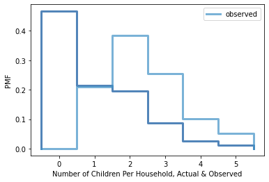

[Think Stats Chapter 3 Exercise 1](http://greenteapress.com/thinkstats2/html/thinkstats2004.html#toc31) (actual vs. biased)

>Use the NSFG respondent variable NUMKDHH to construct the actual distribution for the number of children under 18 in the household.

>Now compute the biased distribution we would see if we surveyed the children and asked them how many children under 18 (including themselves) are in their household.

>Plot the actual and biased distributions. Compute their means.
#### Read in the respondent data
```python
resp = nsfg.ReadFemResp()
```
#### Set up the function for biasing, as given in the text.
```
def BiasPmf(pmf, label):
    new_pmf = pmf.Copy(label=label)
    
    for x, p in pmf.Items():
        new_pmf.Mult(x, x)
    
    new_pmf.Normalize()
    return new_pmf
```   
#### Compute the actual PMF
```python
actual_pmf = thinkstats2.Pmf(resp.numkdhh, label='Actual')
```
#### Compute the biased PMF
```python
biased_pmf = BiasPmf(actual_pmf, label='Observed')
```
#### Plot both actual and observed PMFs
```python
thinkplot.PrePlot(2)
thinkplot.Pmfs([actual_pmf, biased_pmf])
thinkplot.Config(xlabel='Number of Children Per Household, Actual & Observed', ylabel='PMF')
```


#### Compute the respective means
```python
print('Actual mean: ', actual_pmf.Mean())
print('Observed mean: ', biased_pmf.Mean())
```
Actual mean:  1.024205155043831

Observed mean:  2.403679100664282
