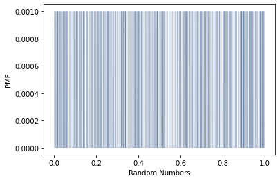
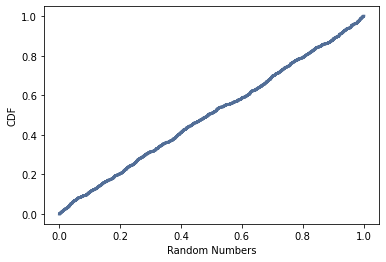

[Think Stats Chapter 4 Exercise 2](http://greenteapress.com/thinkstats2/html/thinkstats2005.html#toc41) (a random distribution)

>>The numbers generated by random.random are supposed to be uniform between 0 and 1; that is, every value in the range should have the same probability.
Generate 1000 numbers from random.random and plot their PMF and CDF. Is the distribution uniform?

#### Generate 1000 numbers from random.random
```python
random_nums = np.random.random(1000)
```

#### Plot the PMF of the distribution
```python
pmf_random = thinkstats2.Pmf(random_nums)
thinkplot.Pmf(pmf_random, linewidth = 0.08)
thinkplot.Config(xlabel = 'Random Numbers', ylabel = 'PMF')
```


Every random number generated from random.random has an equal probability of 0.0010, per the PMF.

#### Plot the CDF of the distribution
```python
cdf_random = thinkstats2.Cdf(random_nums)
thinkplot.Cdf(cdf_random)
thinkplot.Config(xlabel = 'Random Numbers', ylabel = 'CDF')
```



The expected CDF should be a linear function with even increase from 0 to 1. The CDF plot line is very close to linear, but does show some minute deviations and corrections.  The random.random generator is not perfectly random, but very, very close to random.

